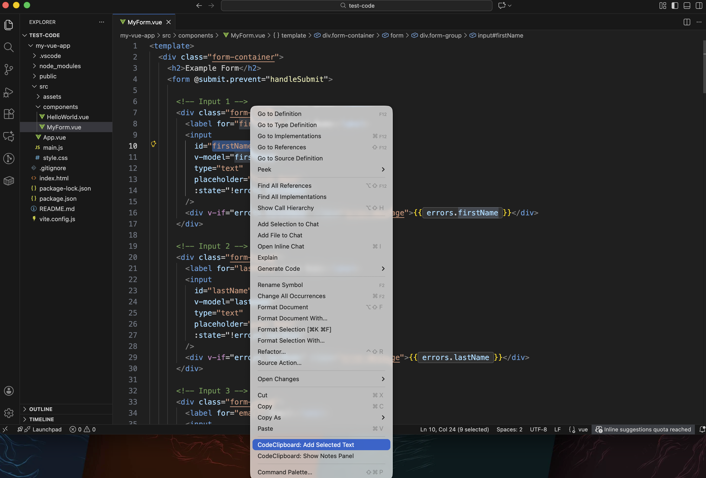
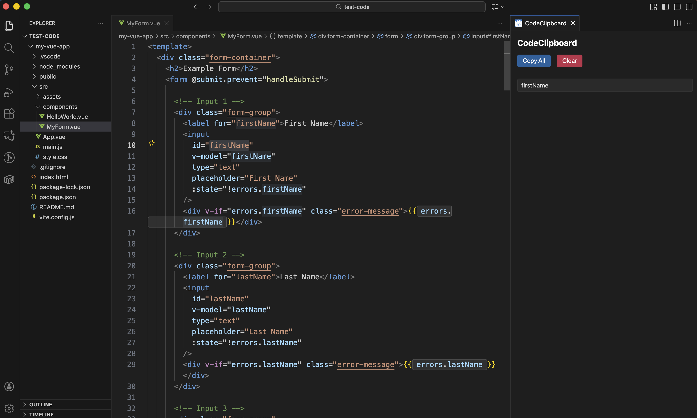

# CodeClipboard — Smart Temporary Clipboard for VS Code  
### Save selected snippets instantly. No scrolling. No losing track.

**CodeClipboard** is a lightweight, fast, and smart temporary clipboard panel for VS Code.  
Select any text → right–click → **Add to CodeClipboard** → all your snippets stay visible in a clean side panel for quick reference.

Perfect when you're working across multiple files and need to copy/paste pieces of code without losing context.

---

## 🚀 Features

### ✅ Smart temporary clipboard panel  
Stores your selected text snippets in a clean WebView panel — easy to scan, copy, or clear.

### ✅ Quick “Add to CodeClipboard” from the editor  
Right–click any selected text and add it instantly.  
Also available from the Command Palette.

### ✅ Automatic panel opening  
When you add a snippet and the panel is closed, it opens automatically.

### ✅ Clean & modern UI  
Includes:
- Better spacing  
- Subtle borders  
- Clear buttons: **Copy All** and **Clear**  
- Auto-updating snippet list  

### ✅ Panel-only icon  
The extension keeps VS Code clean — **no clutter in the activity bar**.  
The panel uses its own icon for a polished look.

---

## 🖼️ Screenshots

https://github.com/user-attachments/assets/a39b505a-25f3-444e-98b5-6ac829953f2d

| Adding selected text | Notes Panel |
|----------------------|-------------|
|  |  |

---

## 📌 How to Use

### **1. Add selected text**
- Highlight text in the editor  
- Right-click → **Add to CodeClipboard**  
- Or through Command Palette: CMD+SHIFT+P -> CodeClipboard: Add Selected Text

### **2. Show the panel**
- Right-click → **Show to Notes Panel**  
- Or through Command Palette: CMD+SHIFT+P -> CodeClipboard: Show Notes Panel
- Or it opens automatically when adding a snippet for the first time.

### **3. Manage your snippets**
Inside the panel you can:

- **📋 Copy All** → copy everything to your system clipboard  
- **🗑️ Clear** → delete all stored snippets  

---

## ⚙️ Commands

| Command ID                     | Description                       |
|--------------------------------|-----------------------------------|
| `codeClipboard.addNote`        | Adds selected text to clipboard   |
| `codeClipboard.showPanel`      | Opens the notes panel             |
| `codeClipboard.clearNotes`     | Clears all stored snippets        |

---

## 🧭 Context Menu Options

Right–click inside the editor:

- **Add to CodeClipboard** (only when you have selected text)
- **Show CodeClipboard**  

These appear grouped and separated from the other default menu items.

---

## 🛠️ Requirements

No requirements or external libraries.  
Everything runs in-memory — lightweight and fast.

---

## 📂 Extension Settings

Currently no settings available.  
Possible future additions:
- Persistent mode (save snippets between VS Code sessions)
- Tags / groups
- Export to file (JSON or markdown)

---

## 🤝 Contributing

Contributions are welcome!

👉 Submit issues or pull requests at:  
**https://github.com/jimolina/codeclipboard**

---

## 📄 License

MIT License.

---

## 🙌 Author

**José Molina**  
Created with ❤️ for developers who juggle snippets all day.
